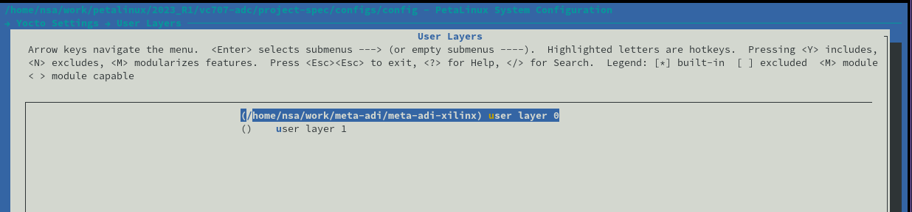

## META-ADI-XILINX

This is the Analog Devices yocto layer to make it easier to integrate ADI linux kernel, device trees and userspace utilities (eg: libiio) onto Xilinx SoC FPGA based systems.

### Dependencies

To add Analog devices tools (eg: libiio) the [meta-adi-core](https://github.com/analogdevicesinc/meta-adi/tree/2019_R2/meta-adi-core) has to be included. By default, when building [petalinux-user-image](https://github.com/analogdevicesinc/meta-adi/blob/2019_R2/meta-adi-xilinx/dynamic-layers/meta-plnx-generated/recipes-core/images/petalinux-user-image.bbappend), this layer is needed.

### Supported Projects

| HDL | Devicetree |
| --- | ---------- |
|[fmcomms2_zed](https://github.com/analogdevicesinc/hdl/tree/hdl_2019_r2/projects/fmcomms2/zed)|[zynq-zed-adv7511-ad9361-fmcomms2-3](https://github.com/analogdevicesinc/linux/blob/2019_R2/arch/arm/boot/dts/zynq-zed-adv7511-ad9361-fmcomms2-3.dts)|
|[fmcomms2_zc706](https://github.com/analogdevicesinc/hdl/tree/hdl_2019_r2/projects/fmcomms2/zc706)|[zynq-zc706-adv7511-ad9361-fmcomms2-3](https://github.com/analogdevicesinc/linux/blob/2019_R2/arch/arm/boot/dts/zynq-zc706-adv7511-ad9361-fmcomms2-3.dts)|
|[fmcomms5_zc702](https://github.com/analogdevicesinc/hdl/tree/hdl_2019_r2/projects/fmcomms5/zc702)|[zynq-zc702-adv7511-ad9361-fmcomms5](https://github.com/analogdevicesinc/linux/blob/2019_R2/arch/arm/boot/dts/zynq-zc702-adv7511-ad9361-fmcomms5.dts)|
|[fmcomms5_zc706](https://github.com/analogdevicesinc/hdl/tree/hdl_2019_r2/projects/fmcomms5/zc706)|[zynq-zc706-adv7511-ad9361-fmcomms5](https://github.com/analogdevicesinc/linux/blob/2019_R2/arch/arm/boot/dts/zynq-zc706-adv7511-ad9361-fmcomms5.dts)|
|[fmcomms11_zc706](https://github.com/analogdevicesinc/hdl/tree/hdl_2019_r2/projects/fmcomms11/zc706)|[zynq-zc706-adv7511-fmcomms11](https://github.com/analogdevicesinc/linux/blob/2019_R2/arch/arm/boot/dts/zynq-zc706-adv7511-fmcomms11.dts)|
|[daq2_zc706](https://github.com/analogdevicesinc/hdl/tree/hdl_2019_r2/projects/daq2/zc706)|[zynq-zc706-adv7511-fmcdaq2](https://github.com/analogdevicesinc/linux/blob/2019_R2/arch/arm/boot/dts/zynq-zc706-adv7511-fmcdaq2.dts)|
|[adrv9361z7035_ccbob_cmos](https://github.com/analogdevicesinc/hdl/tree/hdl_2019_r2/projects/adrv9361z7035/ccbob_cmos)|[zynq-adrv9361-z7035-bob-cmos](https://github.com/analogdevicesinc/linux/blob/2019_R2/arch/arm/boot/dts/zynq-adrv9361-z7035-bob-cmos.dts)|
|[adrv9361z7035_ccbob_lvds](https://github.com/analogdevicesinc/hdl/tree/hdl_2019_r2/projects/adrv9361z7035/ccbob_lvds)|[zynq-adrv9361-z7035-bob](https://github.com/analogdevicesinc/linux/blob/2019_R2/arch/arm/boot/dts/zynq-adrv9361-z7035-bob.dts)|
|[adrv9361z7035_ccfmc_lvds](https://github.com/analogdevicesinc/hdl/tree/hdl_2019_r2/projects/adrv9361z7035/ccfmc_lvds)|[zynq-adrv9361-z7035-fmc](https://github.com/analogdevicesinc/linux/blob/2019_R2/arch/arm/boot/dts/zynq-adrv9361-z7035-fmc.dts)|
|[adrv9364z7020_ccbob_cmos](https://github.com/analogdevicesinc/hdl/tree/hdl_2019_r2/projects/adrv9364z7020/ccbob_cmos)|[zynq-adrv9364-z7020-bob-cmos](https://github.com/analogdevicesinc/linux/blob/2019_R2/arch/arm/boot/dts/zynq-adrv9364-z7020-bob-cmos.dts)|
|[adrv9364z7020_ccbob_lvds](https://github.com/analogdevicesinc/hdl/tree/hdl_2019_r2/projects/adrv9364z7020/ccbob_lvds)|[zynq-adrv9364-z7020-bob](https://github.com/analogdevicesinc/linux/blob/2019_R2/arch/arm/boot/dts/zynq-adrv9364-z7020-bob.dts)|
|[adrv9009_zc706](https://github.com/analogdevicesinc/hdl/tree/hdl_2019_r2/projects/adrv9009/zc706)|[zynq-zc706-adv7511-adrv9009](https://github.com/analogdevicesinc/linux/blob/2019_R2/arch/arm/boot/dts/zynq-zc706-adv7511-adrv9009.dts)|
|[adrv9009_zc706](https://github.com/analogdevicesinc/hdl/tree/hdl_2019_r2/projects/adrv9009/zc706)|[zynq-zc706-adv7511-adrv9008-1-jesd204-fsm](https://github.com/analogdevicesinc/linux/blob/2019_R2/arch/arm/boot/dts/zynq-zc706-adv7511-adrv9008-1-jesd204-fsm.dts)|
|[adrv9009_zc706](https://github.com/analogdevicesinc/hdl/tree/hdl_2019_r2/projects/adrv9009/zc706)|[zynq-zc706-adv7511-adrv9008-2-jesd204-fsm](https://github.com/analogdevicesinc/linux/blob/2019_R2/arch/arm/boot/dts/zynq-zc706-adv7511-adrv9008-2-jesd204-fsm.dts)|
|[adrv9371x_zc706](https://github.com/analogdevicesinc/hdl/tree/hdl_2019_r2/projects/adrv9371x/zc706)|[zynq-zc706-adv7511-adrv9371](https://github.com/analogdevicesinc/linux/blob/2019_R2/arch/arm/boot/dts/zynq-zc706-adv7511-adrv9371.dts)|
|[fmcadc2_zc706](https://github.com/analogdevicesinc/hdl/tree/hdl_2019_r2/projects/fmcadc2/zc706)|[zynq-zc706-adv7511-ad9625-fmcadc2](https://github.com/analogdevicesinc/linux/blob/2019_R2/arch/arm/boot/dts/zynq-zc706-adv7511-ad9625-fmcadc2.dts)|
|[ad6676evb_zc706](https://github.com/analogdevicesinc/hdl/tree/hdl_2019_r2/projects/ad6676evb/zc706)|[zynq-zc706-adv7511-ad6676-fmc](https://github.com/analogdevicesinc/linux/blob/2019_R2/arch/arm/boot/dts/zynq-zc706-adv7511-ad6676-fmc.dts)|
|[daq3_zc706](https://github.com/analogdevicesinc/hdl/tree/hdl_2019_r2/projects/daq3/zc706)|[zynq-zc706-adv7511-fmcdaq3-revC](https://github.com/analogdevicesinc/linux/blob/2019_R2/arch/arm/boot/dts/zynq-zc706-adv7511-fmcdaq3-revC.dts)|
|[imageon_zed](https://github.com/analogdevicesinc/hdl/tree/hdl_2019_r2/projects/imageon/zed)|[zynq-zed-imageon](https://github.com/analogdevicesinc/linux/blob/2019_R2/arch/arm/boot/dts/zynq-zed-imageon.dts)|
|[adv7511_zc706](https://github.com/analogdevicesinc/hdl/tree/hdl_2019_r2/projects/adv7511/zc706)|[zynq-zc706-adv7511](https://github.com/analogdevicesinc/linux/blob/2019_R2/arch/arm/boot/dts/zynq-zc706-adv7511.dts)|
|[adv7511_zc702](https://github.com/analogdevicesinc/hdl/tree/hdl_2019_r2/projects/adv7511/zc702)|[zynq-zc702-adv7511](https://github.com/analogdevicesinc/linux/blob/2019_R2/arch/arm/boot/dts/zynq-zc702-adv7511.dts)|
|[adv7511_zed](https://github.com/analogdevicesinc/hdl/tree/hdl_2019_r2/projects/adv7511/zed)|[zynq-zed-adv7511](https://github.com/analogdevicesinc/linux/blob/2019_R2/arch/arm/boot/dts/zynq-zed-adv7511.dts)|
|[adrv9001_zed](https://github.com/analogdevicesinc/hdl/tree/hdl_2019_r2/projects/adrv9001/zed)|[zynq-zed-adv7511-adrv9002](https://github.com/analogdevicesinc/linux/blob/2019_R2/arch/arm/boot/dts/zynq-zed-adv7511-adrv9002.dts)|
|[adrv9001_zed](https://github.com/analogdevicesinc/hdl/tree/hdl_2019_r2/projects/adrv9001/zed)|[zynq-zed-adv7511-adrv9002-rx2tx2](https://github.com/analogdevicesinc/linux/blob/2019_R2/arch/arm/boot/dts/zynq-zed-adv7511-adrv9002-rx2tx2.dts)|
|[ad9434_fmc_zc706](https://github.com/analogdevicesinc/hdl/tree/hdl_2019_r2/projects/ad9434_fmc/zc706)|[zynq-zc706-adv7511-ad9434-fmc-500ebz](https://github.com/analogdevicesinc/linux/blob/2019_R2/arch/arm/boot/dts/zynq-zc706-adv7511-ad9434-fmc-500ebz.dts)|
|[ad9467_fmc_zed](https://github.com/analogdevicesinc/hdl/tree/hdl_2019_r2/projects/ad9467_fmc/zed)|[zynq-zed-adv7511-ad9467-fmc-250ebz](https://github.com/analogdevicesinc/linux/blob/2019_R2/arch/arm/boot/dts/zynq-zed-adv7511-ad9467-fmc-250ebz.dts)|
|[ad9265_fmc_zc706](https://github.com/analogdevicesinc/hdl/tree/hdl_2019_r2/projects/ad9265_fmc/zc706)|[zynq-zc706-adv7511-ad9265-fmc-125ebz](https://github.com/analogdevicesinc/linux/blob/2019_R2/arch/arm/boot/dts/zynq-zc706-adv7511-ad9265-fmc-125ebz.dts)|
|[fmcjesdadc1_zc706](https://github.com/analogdevicesinc/hdl/tree/hdl_2019_r2/projects/fmcjesdadc1/zc706)|[zynq-zc706-adv7511-fmcjesdadc1](https://github.com/analogdevicesinc/linux/blob/2019_R2/arch/arm/boot/dts/zynq-zc706-adv7511-fmcjesdadc1.dts)|
|[ad9739a_fmc_zc706](https://github.com/analogdevicesinc/hdl/tree/hdl_2019_r2/projects/ad9739a_fmc/zc706)|[zynq-zc706-adv7511-ad9739a-fmc](https://github.com/analogdevicesinc/linux/blob/2019_R2/arch/arm/boot/dts/zynq-zc706-adv7511-ad9739a-fmc.dts)|
|[dac_fmc_ebz_zc706](https://github.com/analogdevicesinc/hdl/tree/hdl_2019_r2/projects/dac_fmc_ebz/zc706)|[zynq-zc706-adv7511-ad9172-fmc-ebz](https://github.com/analogdevicesinc/linux/blob/2019_R2/arch/arm/boot/dts/zynq-zc706-adv7511-ad9172-fmc-ebz.dts)|
|[adrv9371x_zc706](https://github.com/analogdevicesinc/hdl/tree/hdl_2019_r2/projects/adrv9371x/zc706)|[zynq-zc706-adv7511-adrv9375-jesd204-fsm](https://github.com/analogdevicesinc/linux/blob/2019_R2/arch/arm/boot/dts/zynq-zc706-adv7511-adrv9375-jesd204-fsm.dts)|
|[adrv9009_zcu102](https://github.com/analogdevicesinc/hdl/tree/hdl_2019_r2/projects/adrv9009/zcu102)|[zynqmp-zcu102-rev10-adrv9009-jesd204-fsm](https://github.com/analogdevicesinc/linux/blob/2019_R2/arch/arm64/boot/dts/xilinx/zynqmp-zcu102-rev10-adrv9009-jesd204-fsm.dts)|
|[adrv9009_zcu102](https://github.com/analogdevicesinc/hdl/tree/hdl_2019_r2/projects/adrv9009/zcu102)|[zynqmp-zcu102-rev10-adrv9008-1-jesd204-fsm](https://github.com/analogdevicesinc/linux/blob/2019_R2/arch/arm64/boot/dts/xilinx/zynqmp-zcu102-rev10-adrv9008-1-jesd204-fsm.dts)|
|[adrv9009_zcu102](https://github.com/analogdevicesinc/hdl/tree/hdl_2019_r2/projects/adrv9009/zcu102)|[zynqmp-zcu102-rev10-adrv9008-2-jesd204-fsm](https://github.com/analogdevicesinc/linux/blob/2019_R2/arch/arm64/boot/dts/xilinx/zynqmp-zcu102-rev10-adrv9008-2-jesd204-fsm.dts)|
|[daq2_zcu102](https://github.com/analogdevicesinc/hdl/tree/hdl_2019_r2/projects/daq2/zcu102)|[zynqmp-zcu102-rev10-fmcdaq2](https://github.com/analogdevicesinc/linux/blob/2019_R2/arch/arm64/boot/dts/xilinx/zynqmp-zcu102-rev10-fmcdaq2.dts)|
|[fmcomms2_zcu102](https://github.com/analogdevicesinc/hdl/tree/hdl_2019_r2/projects/fmcomms2/zcu102)|[zynqmp-zcu102-rev10-ad9361-fmcomms2-3](https://github.com/analogdevicesinc/linux/blob/2019_R2/arch/arm64/boot/dts/xilinx/zynqmp-zcu102-rev10-ad9361-fmcomms2-3.dts)|
|[fmcomms5_zcu102](https://github.com/analogdevicesinc/hdl/tree/hdl_2019_r2/projects/fmcomms5/zcu102)|[zynqmp-zcu102-rev10-ad9361-fmcomms5](https://github.com/analogdevicesinc/linux/blob/2019_R2/arch/arm64/boot/dts/xilinx/zynqmp-zcu102-rev10-ad9361-fmcomms5.dts)|
|[daq3_zcu102](https://github.com/analogdevicesinc/hdl/tree/hdl_2019_r2/projects/daq3/zcu102)|[zynqmp-zcu102-rev10-fmcdaq3](https://github.com/analogdevicesinc/linux/blob/2019_R2/arch/arm64/boot/dts/xilinx/zynqmp-zcu102-rev10-fmcdaq3.dts)|
|[adrv9371x_zcu102](https://github.com/analogdevicesinc/hdl/tree/hdl_2019_r2/projects/adrv9371x/zcu102)|[zynqmp-zcu102-rev10-adrv9371-jesd204-fsm](https://github.com/analogdevicesinc/linux/blob/2019_R2/arch/arm64/boot/dts/xilinx/zynqmp-zcu102-rev10-adrv9371-jesd204-fsm.dts)|
|[dac_fmc_ebz_zcu102](https://github.com/analogdevicesinc/hdl/tree/hdl_2019_r2/projects/dac_fmc_ebz/zcu102)|[zynqmp-zcu102-rev10-ad9172-fmc-ebz-mode4](https://github.com/analogdevicesinc/linux/blob/2019_R2/arch/arm64/boot/dts/xilinx/zynqmp-zcu102-rev10-ad9172-fmc-ebz-mode4.dts)|
|[ad9081_fmca_ebz_zcu102](https://github.com/analogdevicesinc/hdl/tree/hdl_2019_r2/projects/ad9081_fmca_ebz/zcu102)|[zynqmp-zcu102-rev10-ad9081-m8-l4](https://github.com/analogdevicesinc/linux/blob/2019_R2/arch/arm64/boot/dts/xilinx/zynqmp-zcu102-rev10-ad9081-m8-l4.dts)|
|[adrv9009zu11eg_adrv2crr_fmc](https://github.com/analogdevicesinc/hdl/tree/hdl_2019_r2/projects/adrv9009zu11eg/adrv2crr_fmc)|[zynqmp-adrv9009-zu11eg-revb-adrv2crr-fmc-revb-jesd204-fsm](https://github.com/analogdevicesinc/linux/blob/2019_R2/arch/arm64/boot/dts/xilinx/zynqmp-adrv9009-zu11eg-revb-adrv2crr-fmc-revb-jesd204-fsm.dts)|
|[adrv9001_zcu102](https://github.com/analogdevicesinc/hdl/tree/hdl_2019_r2/projects/adrv9001/zcu102)|[zynqmp-zcu102-rev10-adrv9002](https://github.com/analogdevicesinc/linux/blob/2019_R2/arch/arm64/boot/dts/xilinx/zynqmp-zcu102-rev10-adrv9002.dts)|
|[adrv9001_zcu102](https://github.com/analogdevicesinc/hdl/tree/hdl_2019_r2/projects/adrv9001/zcu102)|[zynqmp-zcu102-rev10-adrv9002-rx2tx2](https://github.com/analogdevicesinc/linux/blob/2019_R2/arch/arm64/boot/dts/xilinx/zynqmp-zcu102-rev10-adrv9002-rx2tx2.dts)|
|[fmcomms2_kc705](https://github.com/analogdevicesinc/hdl/tree/hdl_2019_r2/projects/fmcomms2/kc705)|[kc705_fmcomms2-3](https://github.com/analogdevicesinc/linux/blob/2019_R2/arch/microblaze/boot/dts/kc705_fmcomms2-3.dts)|
|[fmcomms2_kcu105](https://github.com/analogdevicesinc/hdl/tree/hdl_2019_r2/projects/fmcomms2/kcu105)|[kcu105_fmcomms2-3](https://github.com/analogdevicesinc/linux/blob/2019_R2/arch/microblaze/boot/dts/kcu105_fmcomms2-3.dts)|
|[fmcomms2_vc707](https://github.com/analogdevicesinc/hdl/tree/hdl_2019_r2/projects/fmcomms2/vc707)|[vc707_fmcomms2-3](https://github.com/analogdevicesinc/linux/blob/2019_R2/arch/microblaze/boot/dts/vc707_fmcomms2-3.dts)|
|[daq2_kc705](https://github.com/analogdevicesinc/hdl/tree/hdl_2019_r2/projects/daq2/kc705)|[kc705_fmcdaq2](https://github.com/analogdevicesinc/linux/blob/2019_R2/arch/microblaze/boot/dts/kc705_fmcdaq2.dts)|
|[daq2_kcu105](https://github.com/analogdevicesinc/hdl/tree/hdl_2019_r2/projects/daq2/kcu105)|[kcu105_fmcdaq2](https://github.com/analogdevicesinc/linux/blob/2019_R2/arch/microblaze/boot/dts/kcu105_fmcdaq2.dts)|
|[adrv9371x_kcu105](https://github.com/analogdevicesinc/hdl/tree/hdl_2019_r2/projects/adrv9371x/kcu105)|[kcu105_adrv9371x](https://github.com/analogdevicesinc/linux/blob/2019_R2/arch/microblaze/boot/dts/kcu105_adrv9371x.dts)|
|[fmcadc2_vc707](https://github.com/analogdevicesinc/hdl/tree/hdl_2019_r2/projects/fmcadc2/vc707)|[vc707_fmcadc2](https://github.com/analogdevicesinc/linux/blob/2019_R2/arch/microblaze/boot/dts/vc707_fmcadc2.dts)|
|[fmcadc5_vc707](https://github.com/analogdevicesinc/hdl/tree/hdl_2019_r2/projects/fmcadc5/vc707)|[vc707_fmcadc5](https://github.com/analogdevicesinc/linux/blob/2019_R2/arch/microblaze/boot/dts/vc707_fmcadc5.dts)|
|[fmcjesdadc1_kc705](https://github.com/analogdevicesinc/hdl/tree/hdl_2019_r2/projects/fmcjesdadc1/kc705)|[kc705_fmcjesdadc1](https://github.com/analogdevicesinc/linux/blob/2019_R2/arch/microblaze/boot/dts/kc705_fmcjesdadc1.dts)|
|[fmcjesdadc1_vc707](https://github.com/analogdevicesinc/hdl/tree/hdl_2019_r2/projects/fmcjesdadc1/vc707)|[vc707_fmcjesdadc1](https://github.com/analogdevicesinc/linux/blob/2019_R2/arch/microblaze/boot/dts/vc707_fmcjesdadc1.dts)|
|[ad9467_fmc_kc705](https://github.com/analogdevicesinc/hdl/tree/hdl_2019_r2/projects/ad9467_fmc/kc705)|[kc705_ad9467_fmc](https://github.com/analogdevicesinc/linux/blob/2019_R2/arch/microblaze/boot/dts/kc705_ad9467_fmc.dts)|
|[ad9081_fmca_ebz_vcu118](https://github.com/analogdevicesinc/hdl/tree/hdl_2019_r2/projects/ad9081_fmca_ebz/vcu118)|[vcu118_ad9081_m8_l4](https://github.com/analogdevicesinc/linux/blob/2019_R2/arch/microblaze/boot/dts/vcu118_ad9081_m8_l4.dts)|

### Building with Petalinux

Xilinx based platforms use Petalinx SDK in order to customize, build and deploy Embedded Linux on their platforms. Petalinux is a set of tools which work on top of yocto making it easy to add extra custom layers. For more information on Petalinux and on how to install the SDK refer to the following links:

* [Petalinux User guide](https://www.xilinx.com/support/documentation/sw_manuals/xilinx2019_1/ug1144-petalinux-tools-reference-guide.pdf)
* [Petalinux Wiki](https://xilinx-wiki.atlassian.net/wiki/spaces/A/pages/18842250/PetaLinux)

**This layer supports:**

* **Petalinux-v2019.1;**
* **hdl_2019_r2 (see [hdl](https://github.com/analogdevicesinc/hdl/tree/hdl_2019_r2)).**

To build a petalinux project using Analog Devices yocto layer, run:

```bash
source  <path-to-installed-PetaLinux>/settings.sh
petalinux-create -t project --template <PLATFORM> --name <PROJECT_NAME>, where <PLATFORM> is:
	* zynqMP (for UltraScale + MPSoC)
	* zynq (for Zynq)
	* microblaze (for MicroBlaze)
git clone https://github.com/analogdevicesinc/meta-adi.git
cd <path-to-project>
# Check the Building HDL link below
petalinux-config --get-hw-description=<path to hdf file>
# Select the devicetree that fits the project being built
echo "KERNEL_DTB=${dts_to_use}" >> project-spec/meta-user/conf/petalinuxbsp.conf
cd build
petalinux-build
```

When running the `petalinux-config --get-hw-description=<path to hdf file>`, a configuration menu will come up. Go to Yocto Settings->User layers and add the meta-adi-xilinx and meta-adi-core layers.



>**IMPORTANT: Since this layer depends on meta-adi-core (because of userspace tools), it has to be included after meta-adi-core, otherwise `petalinux-config` will fail.**


To build a BOOT.bin for [Zynq](https://xilinx-wiki.atlassian.net/wiki/spaces/A/pages/18842549/Zynq-7000+SoC) and [ZynqMP](https://www.xilinx.com/products/silicon-devices/soc/zynq-ultrascale-mpsoc.html) platforms run `petalinux-package --boot --fsbl --fpga --u-boot`.  The output file will be placed in `path-to-petalinux-project>/images/linux`. Finally, copy  BOOT.bin and image.ub (FIT image including kernel, device tree and iniramfs) to the boot partition of a SD card.

For [Microblaze](https://xilinx-wiki.atlassian.net/wiki/spaces/A/pages/18842560/MicroBlaze) platforms the Xilinx System Debugger is used to run the linux kernel directly from memory. Run the following commands:

```
cd <path-to-petalinux-project>/images/linux
source <path-to-vivado-sdk>/settings64.sh
xsdb
# In the xsdb system debugger run
connect
run the command targets without any argument to see the available targets
targets <desired target number>
fpga -f system.bit
dow image.elf
con
```

> Notes:
>
>1. To build the desired hdf file refer to [Building HDL](https://wiki.analog.com/resources/fpga/docs/build).
>2. To run the produced image.elf (**for microblaze**) make sure that the Xilinx Vivado SDK is installed.
>3. For an overview of `xsdb` refer to [Xilinx System Debugger Overview](https://www.xilinx.com/html_docs/xilinx2018_1/SDK_Doc/SDK_concepts/concept_Xilinxsystemdebugger.html)
>4. Refer to  [Petalinux User guide](https://www.xilinx.com/support/documentation/sw_manuals/xilinx2019_1/ug1144-petalinux-tools-reference-guide.pdf) for building a MCS boot file for Microblaze

For **Zynq** and **ZynqMP**, one might want to use a complete root filesystem instead of initramfs. To disable initramfs on petalinux:

```bash
cd <path-to-project>
petalinux-config
# On the config menu go to Image Packaging Configuration->Root filesystem type and select SD card
```

With this layer, the default root password is forced to **analog**, overwriting the Petalinux default one. Also note, that the mechanism used by Petalinux to change the password, `petalinux-config -c rootfs`, will no longer work since this layer always overwrites the chosen password. To keep the Petalinux default way go to `<path-to-meta-adi>/meta-adi-xilinx/recipes-cores/images/petalinux-user-image.bbappend` and comment the following lines:

```
EXTRA_USERS_PARAMS = "  \
	usermod -P analog root;"
```

### Extending the devicetree

To extend ADI devicetrees, the normal Petalinux method should be used. Hence, the `system-user.dtsi` file should be used. This file is located under `path-to-project/project-spec/meta-user/recipes-bsp/device-tree/files/`. There is also a `device-tree.bbappend` which automatically selects this file for the build. With this mind, one can either:

 1. Directly change this file with the new devicetree nodes;
 2. Create a new file and add a `#include` or `/include/`directive in `system-user.dtsi`. In these case, changes to the `device-tree.bbappend` recipe are also needed.

### Offline Build

To build petalinux without internet access, run `petalinux-config` and select `BB_NO_NETWORK`. Check [Xilinx Yocto Builds without an Internet Connection](https://xilinx-wiki.atlassian.net/wiki/spaces/A/pages/60129817/Xilinx+Yocto+Builds+without+an+Internet+Connection) for more information.

### FPGA Manager

**FPGA Manager is not officially supported by meta-adi! We just provide some guidelines and hooks in our layer to make it easier to use this feature. In the end, is up to the user to provide the devicetree overlay to be used by the build system.**

When using this, the fpga bitstream is not included in the `BOOT.bin` file, so that, only a base devicetree must be compiled in order to boot the system. This devicetree should not have any node/device that is instantiated by the bitstream (this can, most likely, stuck your kernel at boot). To define the base devicetree add this to your local conf file:

```
DTS_BASE = "your-devicetree"
```

If you don't provide this, the following defaults are taken:

```
DTS_BASE_zynq ?= "${DTS_INCLUDE_PATH}/zynq-zc706"
DTS_BASE_zynqmp ?= "${DTS_INCLUDE_PATH}/zynqmp-zcu102-rev1.0"
DTS_BASE_microblaze ?= "${DTS_INCLUDE_PATH}/vc707"
```

> Naturally, if you are building for a zedboard, you probably don't want to use `zynq-zc706.dts`

After this, it is time to provide your devicetree overlay, by defining the next variables in your local conf file:

```
DTS_OVERLAY = "your-overlay"
DTS_OVERLAY_PATH = "path-to-your-overlay"
```

> NOTE: If you define a custom path, you need to make sure that `dtc` can reach it...

By default, the devicetree recipe defines:

```
DTS_OVERLAY ?= "pl-${KERNEL_DTB}-overlay.dtsi"
DTS_OVERLAY_PATH ?= "${WORKDIR}"
```

If you use the above defaults, you don't need to define these variables in your local conf. Just make sure to append the recipe's `SRC_URI` so that, your overlay is copied to the recipe's `WORKDIR`. (hint: you can further append this recipe...).

> You can see an overlay example for [zcu102-rev10-ad9361-fmcomms2-3](https://github.com/analogdevicesinc/meta-adi/blob/2019_R2/meta-adi-xilinx/recipes-bsp/device-tree/files/pl-zynqmp-zcu102-rev10-ad9361-fmcomms2-3-overlay.dtsi) and [zcu102-rev10-ad9361-fmcomms5](https://github.com/analogdevicesinc/meta-adi/blob/2019_R2/meta-adi-xilinx/recipes-bsp/fpga-manager-util/files/pl-fmcomms5-zcu102-overlay.dtsi).


Additionally, you can also "**Specify hw directory path**" under the FPGA Manager configurations. We also provide an example on how this can be used with meta-adi. Please refer to [fpga-manager-util_%.bbappend](https://github.com/analogdevicesinc/meta-adi/blob/2019_R2/meta-adi-xilinx/recipes-bsp/fpga-manager-util/fpga-manager-util_%.bbappend).


### Adding a new Devicetree

This section serves as guidelines to add a new/custom devicetree which is not supported by default in meta-adi. The first thing that needs to be done is to prepare the `pl-delete-nodes-${KERNEL_DTB}` for the HW being built. We first run a petalinux build just to see the generated nodes in `pl.dtsi` which is found under `path-to-project/components/plnx_workspace/device-tree/device-tree/pl.dtsi`. Assuming the file looks like:

```
amba_pl: amba_pl {
	#address-cells = <1>;
	#size-cells = <1>;
	compatible = "simple-bus";
	ranges;

	custom-node1: node1@79020000 {
		...
	};

	custom-node2: node2@79022000 {
		...
	};

	custom-node3: node3@79024000 {
		...
	};
};
```

The `pl-delete-nodes-${KERNEL_DTB}` should look:

```
/delete-node/ &custom-node1;
/delete-node/ &custom-node2;
/delete-node/ &custom-node3;
```

> NOTE: We typically just want to delete custom nodes which do not refer to xilinx IP cores. If your reference design uses some xilinx IP, you should not delete those nodes since they should be just fine!

Having this done, it is time to add both the devicetree and pl-delete-nodes-${KERNEL_DTB} to the build system. The recommended way of doing this is to further append the devicetree recipe in the following manner (assuming you devicetree is named "`custom-devicetree`"):

```
FILESEXTRAPATHS_prepend := "${THISDIR}/files:"

SRC_URI_append = " \
	pl-delete-nodes-custom-devicetree.dtsi \
	custom-devicetree.dts \
"

KERNEL_DTB_PATH = "${WORKDIR}"
```

> If the project being added is supported by ADI (with no custom changes), the devicetree should be present in the kernel sources. In that case, there's no need to redefine `KERNEL_DTB_PATH` and the `SRC_URI_append` should only contain the `pl-delete-nodes` file. In this case, alternatively, one can also  directly change the [device-tree.bbappend](https://github.com/analogdevicesinc/meta-adi/blob/2019_R2/meta-adi-xilinx/recipes-bsp/device-tree/device-tree.bbappend) recipe and send a PR to meda-adi!